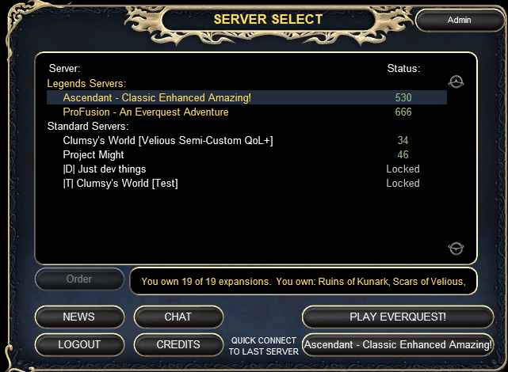

# 03 - Login trust boundary

## What changed

Ascendant's patcher pulls `eqhost.txt` from CDN. Current content activates `login.eqemulator.dev:5999` and comments out `login.eqemulator.net:5999` ([PC-010](operator-share/04-client-patcher-integrity/P1-high/PC-010-eqhost-login-redirect-via-cdn.md)).

Straps documented the `.dev` host for Ascendant players in Discord `#helpful-info` (Mar 14 2026). Pre-migration accounts were told to message him.

In the Jun 4 2026 migration thread, official EQEmu account flows broke for some players; `.dev` took auth; Ali described moving from cloud to a **physical host at the operator's place**.

## Why it matters

`eqemulator.dev` is operator-run infrastructure. The stack stores loginserver password hashes, can federate hashes to peers, and accepts plaintext passwords on web link/validate routes during normal operation. That is product design, not a hidden backdoor. It still means **Straps sits inside the trust boundary** for accounts that patch through his CDN.

With `autoPatch: true` ([PC-020](operator-share/04-client-patcher-integrity/P2-medium/PC-020-autopatch-reapplies-cdn-files.md)), the patcher re-applies CDN files. Editing `eqhost.txt` locally to `.net` can be overwritten on the next patch cycle.

Players reasonably assume `.net` is still canonical EQEmu login. Routing to `.dev` without a loud, first-run consent step is a disclosure failure ([LS-015](operator-share/01-loginserver-brief/P1-high/LS-015-login-path-disclosure-gap.md), [PC-011](operator-share/03-transparency-and-accountability/P1-high/PC-011-no-eqhost-consent-in-patcher.md)), even if the loginserver code is clean. Straps did post about the change in `#helpful-info` and in New Tanaan; that is not the same as telling every patched client at login time.

## Curated server directory (six servers, not the community list)

The Ascendant patcher does not show the full EQEmu community roster. After login through `login.eqemulator.dev`, the in-client **SERVER SELECT** screen showed **six entries** (Jun 2026 capture):

| Tier in client | Servers visible (capture) | Online count (capture) |
|----------------|---------------------------|------------------------|
| **Legends** | Ascendant; ProFusion | 530; 666 |
| **Standard** | Clumsy's World; Project Might; Just dev things (Locked); Clumsy's World Test (Locked) | 34; 46; Locked; Locked |

That is a **curated federation directory**, not the public community login list on `eqemulator.net`, which at the same period listed **dozens** of live worlds (Project 1999 Green/Blue/Red, Project Quarm, Project Lazarus, PEQ, EQ Might, Dragon Soul, Ascendant under Standard at ~526, and many more).

**Why it reads as favoritism:** The operator's two servers sit alone in **Legends** at the top. Most of the broader EQEmu ecosystem is absent from this view. Players who patch through Ascendant's CDN never see the community list unless they manually revert `eqhost.txt` to `.net` (and keep it there past the next auto-patch).

We do **not** know whether every server that points at `eqemulator.dev` gets the same six-row view; we only captured the Ascendant patcher path. The architecture still matters: the federation **master controls** which worlds appear, their **Legends / Preferred / Standard** tier labels, and **trusted / claimed** flags ([LS-025](operator-share/01-loginserver-brief/P2-medium/LS-025-directory-curation-trust-labels.md)). That is governance and routing power, not a neutral mirror of the community-built loginserver.

## LSPX: first `.dev` login copies your `.net` account

You do **not** need to manually "create" or "link" a `.dev` account for this to apply. If you ever logged into Ascendant (or any server) through **`login.eqemulator.dev:5999`** with your normal eqemu username and password, the loginserver **validates against `login.eqemulator.net`**, then **inserts a local row** in operator MariaDB with the **same account id** and a **scrypt hash** (`source_loginserver='eqemu'`). That is documented product behavior ([LS-010](operator-share/01-loginserver-brief/P1-high/LS-010-lspx-credential-cache-game-login.md)), not a hidden exploit.

**Lab proof (2026-06-13):** Full EQ client login through the lab stack with legacy credentials created `login_accounts` row **id 630868**, `source_loginserver=eqemu`, matching the upstream `.net` account id from `POST /v1/account/credentials/validate/external`. Validate-only API checks `.net` but **does not insert**; **game login does**.

Straps told players the local loginserver **"makes your local account when you login the first time, then links if you have characters"** (Discord `#helpful-info`). Patch notes (Mar 13 - 14 2026) promised auto-link so both loginservers would work.

**Implication:** Ascendant patcher users who logged in once are **already in the operator DB**, even if they never visited eqemulator.dev in a browser.

## Two passwords, one username (easy to conflate)

Changing credentials on `.dev` is **not** the same as changing them on **`login.eqemulator.net`**.

| Action | What changes |
|--------|----------------|
| First game login via `.dev` with `.net` password | Local hash **cached** on operator DB (LSPX insert) |
| Change password on **`eqemulator.net`** | `.net` password; `.dev` FAQ says next **client login** re-syncs **from .net → local** |
| Change password **on eqemulator.dev website** (`/api/account/password`) | **Platform** web login only - **not** the EQ client `login_accounts` row |
| Operator / admin reset via loginserver API (`update/local` or `update/external`) | **Local game-login hash** on `.dev` stack |
| Staff help: "changed the password **with us through the website**" (Straps, Mar 31 2026) | **Local / operator-side** password - Straps also said that is **"not resetting your eqemulator password"** |

Staff also told players (Mar 31): **"this server doesnt sync with that any more"** (`.net` vs local), and password issues often mean **".net password is different than what you have been using for our server / local password."**

**If you changed your game password through the operator login stack:** you likely updated the **local cached copy** used when `eqhost.txt` points at `.dev`. That can **lock you out of Ascendant** while **`login.eqemulator.net` still accepts the old password** for P99, Quarm, etc. (or the reverse if local was stale). Same username, **two stores**, poorly disclosed.

**Lab:** `POST /v1/account/credentials/update/external` with the loginserver API token **overwrites** an existing `login_accounts` hash (AV-LS-007). That is operator tooling power, not player self-service - but it is the same table your client hits.

## Federation blast radius (can another server steal your account?)

The login gateway is not just "where passwords go." It is a **control plane** that can **replicate credential hashes** to every federation peer the operator approves ([LS-012](operator-share/01-loginserver-brief/P1-high/LS-012-federation-sync-data-hash-export.md)).

**Short answer:** A random unapproved EQEmu server **cannot** pull your hash or change your password. An **approved federation peer** (or anyone who steals its Ed25519 key, or a master admin who approves a rogue node) **can** threaten accounts in the synced population.

| Scenario | Can they pull password hashes? | Can they take over an account? |
|----------|-------------------------------|--------------------------------|
| Anonymous internet user | No (`sync_data` returns 401) | No |
| Unapproved federation node | No (403 not approved) | No |
| **Approved peer operator (malicious or compromised)** | **Yes** (`GET /api/federation/sync_data`, lab reproduced) | **Yes, in principle** (see below) |
| Master admin adds rogue peer via bootstrap | Peer becomes approved | Same as row above |

**Hash export:** Approved peers receive `account_password` scrypt fields for the synced account table. Weak passwords remain crackable offline like any hash leak.

**Password push:** Federation code exposes `POST /api/federation/password_sync`. Any **approved** peer can sign a request that **updates** `login_accounts.account_password` by row id on the receiving node. Row ids are visible in the same `sync_data` export. Investigators did not run a live takeover test on production; the **code path exists** and is authenticated by peer identity, not by account owner consent.

**What we do not claim:** No evidence that a specific third-party operator abused this against Ascendant players. The risk is **structural**: high trust concentration, opaque peer list, and hash replication by design.

**Who is in the blast radius:** Any account with a row in the federation `login_accounts` table - including **LSPX-cached** legacy `.net` logins after one successful game login through `.dev`. You do not need a separate signup.

**Practical mitigation:** Assume **one successful Ascendant login** copied your credentials into operator infrastructure. Use a **password unique to Ascendant / `.dev`**, not reused on `.net`, email, or Discord. If you want the full community server list and foundation login path, point `eqhost.txt` at `.net` (knowing Ascendant auto-patch may revert it). Treat `.net` and `.dev` as **two password stores** until the operator publishes a clear sync policy.

Wider operational-security context (portal APIs, Profusion overlap, Discord-only trust docs): [04b-operational-security](04b-operational-security.md).

## What we do not claim

No proof of credential theft, malware, or MITM in the reviewed web codebase. The finding is **centralized trust**, not hidden exfiltration.

## Related quotes

See [data/discord-quotes-public.md](data/discord-quotes-public.md) tags `03-login-trust-boundary`.

Lab tests, environment, and reproduction: [03b-loginserver-lab-methodology](03b-loginserver-lab-methodology.md).

Next: [03b-loginserver-lab-methodology](03b-loginserver-lab-methodology.md)
