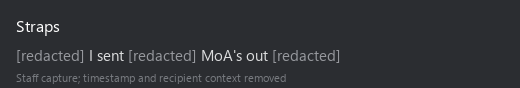
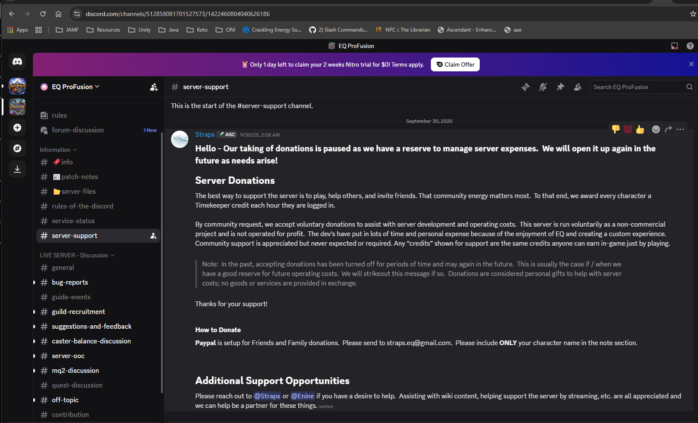
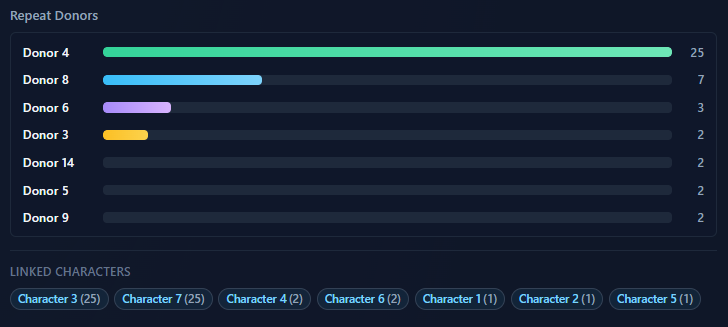

# 05 - Donations, MoA, and Ko-fi

## Official posture vs what actually happens

Ascendant's public line is familiar: donations are voluntary gifts for hosting and tooling, not a purchase, no goods or services in exchange. Straps posted that in `#server-support` (Feb 20 2026). Ko-fi and the website repeat the same framing.

In-game, Marks of Ascendance are a premium currency. They extend server-wide buffs, buy bags and vendor unlocks at Exarch Valeth, and show up in referral contests and leaderboard gamification. That is not cosmetic fluff. It is materially valuable.

This chapter and [08-referrals-leaderboards](08-referrals-leaderboards.md) focus on **MoA** because that is what ties to Ko-fi, referrals, and staff sends. **Illegible Tomes, AA Insights, and Shards of Ascendant Power** are separate progression/trade items; we have not found evidence of those being mailed to donors or referrers.

Straps also confirmed in a staff capture that he **sent MoA to players** tied to support activity. The published image shows **only** the username and the fragments "I sent" / "MoA's out". Timestamp, avatar, badges, and surrounding wording are removed so the capture cannot be traced back to a recipient.

When the forum says "no exchange," the Ko-fi page says "voluntary gift," and the operator is manually sending MoA after USD support, those statements do not reconcile without redefining what "exchange" means.

## ProFusion: same operator, same rails (PayPal Friends and Family)

Straps did not invent the Ascendant donation model from scratch. **ProFusion** (his prior server) ran the same playbook in public `#server-support`.

**Straps, EQ ProFusion `#server-support`, 2023-09-30:** Donations paused while a reserve covered expenses, but the published instructions were explicit:

- PayPal set up for **Friends and Family** payments to `straps.eq@gmail.com`
- Donor must put **only their character name** in the PayPal note
- Copy still claimed donations were personal gifts with **no goods or services in exchange**
- Players earned **Timekeeper credits** for time logged in (in-game utility tied to support posture)

Friends and Family is not a neutral payment choice. It routes money outside PayPal's normal goods-and-services protections and fee structure. Pair that with a character-name field and in-game credit systems, and you are looking at USD linked to specific accounts with operator-controlled fulfillment, not a tip jar.

Straps later stepped back from day-to-day ProFusion work to focus on Ascendant (May 2026 Discord). The payment and "no exchange" language carried forward. Ascendant moved the public lane to Ko-fi, but kept the same shape: non-commercial framing, character linkage on donations, in-game premium currency on the other side.

## Ko-fi runway optics

BotWatch snapshot (Jun 27 2026): public support page showed **~$411/mo** as the runway burn rate and **~5.4 months** runway. That figure is presented as the monthly cost basis for donations, with **hosting** language in the appeals copy. Investigators estimate **~$55/mo** generous **infrastructure-only** burn (OVH web + home electricity + residential ISP marginal). **Total operation** including operator and dev time could fairly reach **$411+**; the transparency gap is that only **infra** is implied on the page, not a split budget. See [11-hosting-cost-gap](11-hosting-cost-gap.md).

The database retained more Ko-fi history than the public feed displayed at various points.

### BotWatch dashboard (section crops, Jun 27 2026)

These are **investigator-side** BotWatch Ko-fi Donors panels, not something Ascendant publishes. Donor and character labels are opaque tokens only.

**Sidebar readout:** runway **5.38 mo** / **$2,210** total (updated May 27); **50** tips from **14** people, **6** subs (**1/6** named on feed), **38** hidden from public feed; **min floor $322** cumulative; published **$411/mo** vs estimated infra **$55/mo** (**$356 pub. gap**); Ko-fi est **$192/mo** (**47%** of published, **349%** of est infra).

**Chart readout:** green **min floor** ends **$322** (tier minimums on each event). Dotted bands assume **$10 / $20 / $35** per tip. Horizontal lines: **$55/mo est infra** vs **$411/mo published**. Even the conservative floor sits below published infra; the $10/tip band crosses **$411** around late June.

**Concentration readout:** one repeat donor bucket (**D-4**, **25** events) dominates; linked-character panel shows the same weight on two tokens (**Character 3** and **Character 7**, **25** each). Useful for asymmetry context in [06-enforcement-asymmetry](06-enforcement-asymmetry.md) and [08-referrals-leaderboards](08-referrals-leaderboards.md); not proof of favoritism on its own.

Full numbers: [data/investigator-cost.json](data/investigator-cost.json) (`botwatch_kofi_dashboard_snapshot_2026_06_27`). Event-level backing (anonymized tokens, no donor names): [data/kofi-events-anonymized.csv](data/kofi-events-anonymized.csv).

Full **RMTkr Ledger** tab layout and third-party plat forum capture: [09b-botwatch-capabilities](09b-botwatch-capabilities.md#rmtkr-donation-ledger-and-market-intel).

## Feed visibility: operator claim vs Ko-fi docs vs telemetry

### Operator claim (paraphrased only)

In a private message (screenshot withheld), Straps characterized missing Ko-fi feed entries as **normal platform behavior where the public feed empties or clears on its own**.

> Exhibit withheld: operator DM screenshot; recipient-traceable. Original held in the private investigation record.

### Ko-fi Help Center

Official article ["Public & private options"](https://help.ko-fi.com/hc/en-us/articles/360009392953-What-information-do-supporters-share-Public-private-options) documents:

- Supporters choose public vs private at checkout.
- Either **creator or logged-in supporter** may hide a public line later via three-dot menu → **Make Message Private**.
- Creator still sees hidden lines.
- **No** documented random cleanup, bulk deduplication, or platform-initiated purges.

### BotWatch observed

From Ko-fi feed sync (Jun 12 - 27 2026; ~two-week monitoring window):

- **744** `kofi_feed_purge_log` polling cycles (~every 15 min while the public feed stayed empty).
- **38** tips flagged hidden from the public Ko-fi feed while retained in BotWatch DB (Jun 27 dashboard; **50** tips tracked total).
- **34** first-time purge detections across those cycles (`newly_purged` sum). Do **not** use `SUM(marked_absent)` from the purge log: an earlier metrics bug re-counted the same rows every poll when `feed_purged_last_checked_at` updated (~25 rows × 744 polls ≈ 18k; not 18k unique events).
- Jun 15 14:41 UTC: last pull with **7** visible donors.
- Jun 15 14:56 UTC: **0** donors; feed empty since.

The "platform does it" explanation is a **misrepresentation of Ko-fi's published mechanics**. The telemetry fits **administrative curation by the operator**, not undocumented platform behavior, and it points to **questionable ethics from the provider** running the page, not a Ko-fi glitch.

## Withheld player-linking exhibits

> Exhibit withheld: in-game capture linking MoA bazaar activity to named players. Player privacy. Original held in the private investigation record.

Next: [06-enforcement-asymmetry](06-enforcement-asymmetry.md)
