# 09b - What BotWatch can reconstruct

Chapter [09-botwatch-methodology](09-botwatch-methodology.md) covers **how** the stack runs (Ko-fi sync, AFK scoring, cost). This chapter shows **what a single watched character looks like** once `/who` sampling, inventory pulls, and signal rules stack up.

All exhibits below use **Mask** mode where noted: real handles become `Character ####` / `Guild ###`. The [Chardok pair deep dive](#chardok-pair-deep-dive-actor-1-actor-2) uses redacted reporter crops (**Actor_1** / **Actor_2** only in prose); argument lives in [06-enforcement-asymmetry](06-enforcement-asymmetry.md).

---

## Roster scale and AFK scoring

BotWatch rolls the full Ascendant roster into sortable tables: class, level, zone share, session length, HP/AC/AA, and an **AI** column (automation suspicion, not a ban verdict).

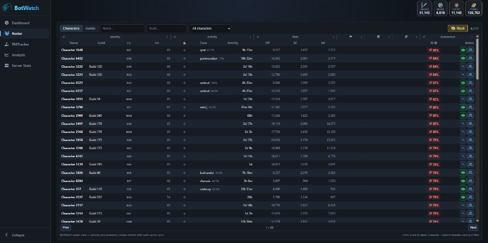

One page of a multi-thousand-character roster. Scores in the **78 - 90%** band on this sort are common on the high-AFK tail described in [06-enforcement-asymmetry](06-enforcement-asymmetry.md). The watch list is curated; the roster view shows the wider field staff could see if they ran similar tooling.

---

## Presence, streaks, and zone time

For a watched target, BotWatch rebuilds **uptime** from repeated `/who` checks:

| Metric (example character, Jun 2026) | Value |
|--------------------------------------|------:|
| Total online (period) | 4d 3h |
| Longest streak | 3d 6h |
| Current streak (snapshot) | 9d 21h |
| Primary zone | chardok (~95% of observed time) |
| Loot delta (period) | +415 / −398 items |
| AA spent (observed) | 8,633 |

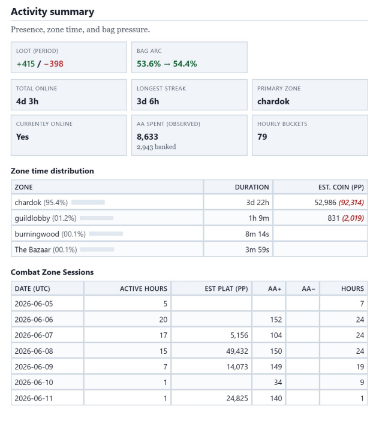

The zone table is not a guess from chat. It is compiled from **zone session rows** (start, end, duration). Example: one **chardok** block ran **23h 36m** before a brief hub visit.

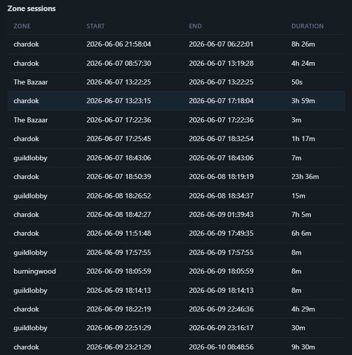

That pattern (marathon camp, minutes in town, return to camp) is what players describe when they report "obvious AFK boxes." BotWatch can produce the same timeline without opening a ticket.

---

## Chardok pair deep dive (Actor_1 / Actor_2)

Enforcement read (rules vs staff dismissal vs ban-wave timing): [06-enforcement-asymmetry](06-enforcement-asymmetry.md#chardok-camp-case-jun-2026). Ali's sarcastic dismissal: [12-operator-presence](12-operator-presence.md#afk-dismissal-in-public-discord).

> **Disclosure (timelines):** All BotWatch activity timestamps in these crops are **UTC (GMT+0)**. A **large empty gap** appears on the stacked zone lane (~**06/09 01:00 - 11:00** UTC in the Jun 8 - 9 window). That gap is an **undocumented tracking outage** on our side (sampler/worker issue), not a labeled "character offline" event in the UI. Do **not** read it as proof both actors logged off for ten hours. What still holds: wherever samples exist, **both lanes start and end the gap together** and show **matching chardok / guildlobby hops** at the same UTC timestamps.

**Actor_1** - bot stopped, character stayed. After bags filled, loot flatlines while the toon remained in **chardok** for days. (Ali's in-game screenshot target; name and guild tag redacted in crop.)

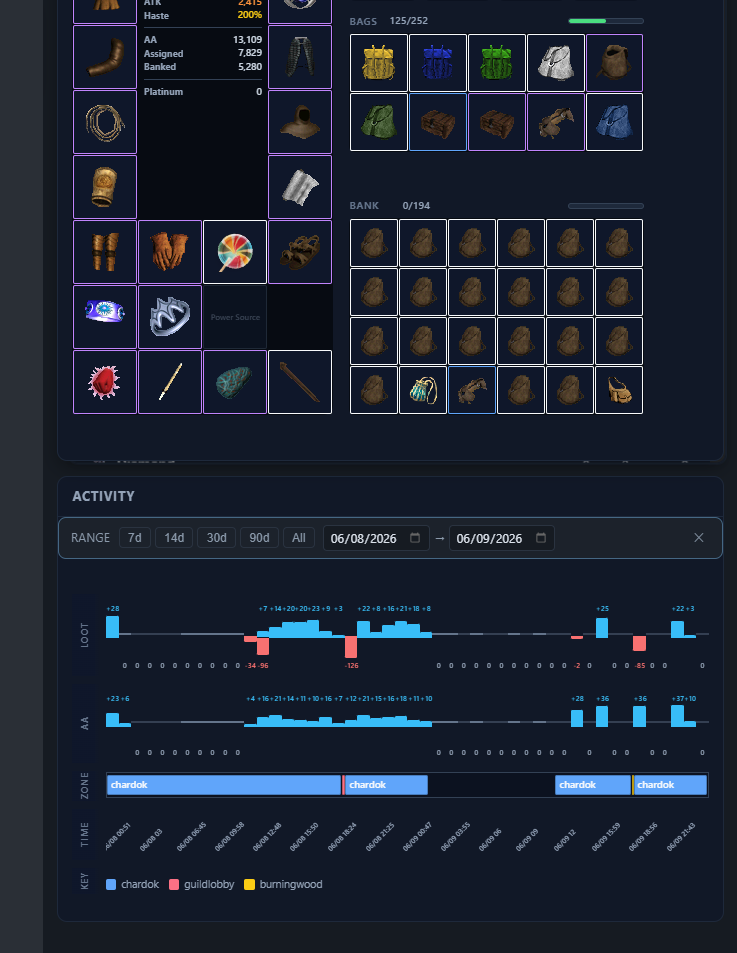

**Actor_2** - bags full, AA grind kept going. Same guild watch cluster, same zone habit. On the two-day window below, **loot goes flat for long stretches while AA bars stay steady** in **chardok**.

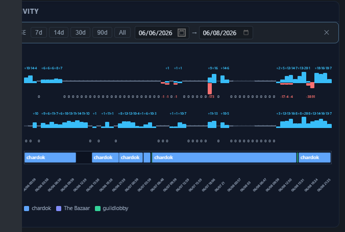

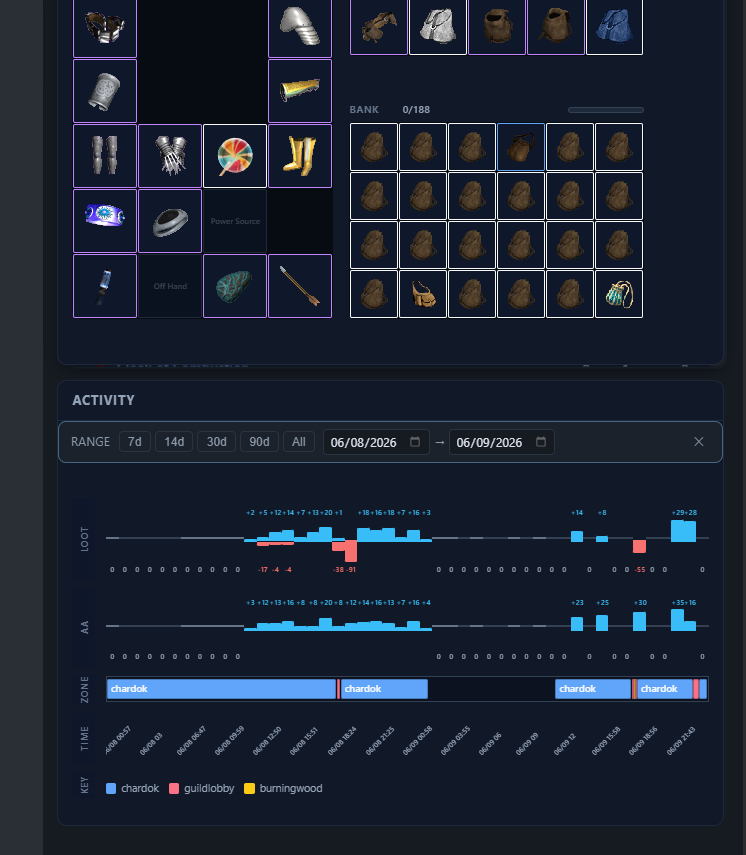

**Same operator read (plausible, not proven).** Stack the **Jun 8 - 9** Actor_1 and Actor_2 zone lanes on one timeline. Both leave **chardok** for **guildlobby** at the same window, then return to **chardok** together. On that hop **Actor_2** shows a vendor dump (red loot bars: −96, −126); **Actor_1** makes the same zone trip without loot delta. Different behavior in camp (Actor_1 parked after fill, Actor_2 still earning AA), but **identical hub routing** is what you expect from one person running two clients on one routine, not independent farmers.

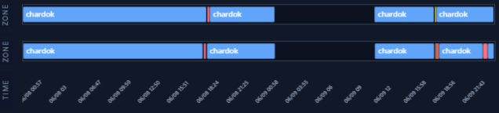

The stacked crop is the strongest single exhibit for sync **where data exists**: same **chardok** marathon blocks, the **same undocumented sampling gap** on both lanes (see disclosure above), aligned resume (~**06/09 11:00 UTC**), and matching mid-camp hub hops (red/orange transitions). That pattern fits one multibox routine more than two independent farmers; the gap itself is a telemetry hole, not an in-game fact.

**Bag pressure without a stop condition.** Hourly lanes (no date filter on this crop): **BAGS** pinned red (full), **LOOT** flat, **AA** still ticking in **chardok**. No bag-full check; grind until the operator returns.

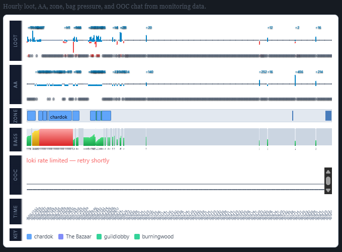

**Staff screenshot (Actor_1).** Ali's `#general` post with guide POV in camp - paired with the BotWatch rows above. In-game nameplate and guild tag blacked out; **Ali - Kalioptra** kept.

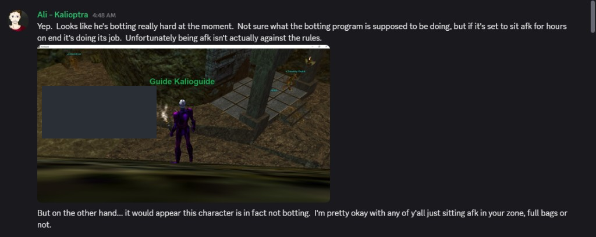

**How to read the lanes**

- **Loot flat + AA steady** in one zone → likely still killing with full bags or filtered loot.
- **Loot flat + toon parked** → script stopped or character left unattended after fill.
- **Bags red + AA ticking** → automation with no inventory stop (Actor_2-style window).
- **Matching chardok → guildlobby → chardok hops** at the same **UTC** window across Actor_1 and Actor_2 → plausible same operator (compare Jun 8 - 9 crops; ignore undocumented sampling gaps).

---

## Hourly activity timeline

The **Activity timeline** lanes stack loot deltas, AA gain, zone color bands, bag fill pressure, and (when Loki is healthy) OOC chat markers on one UTC axis.

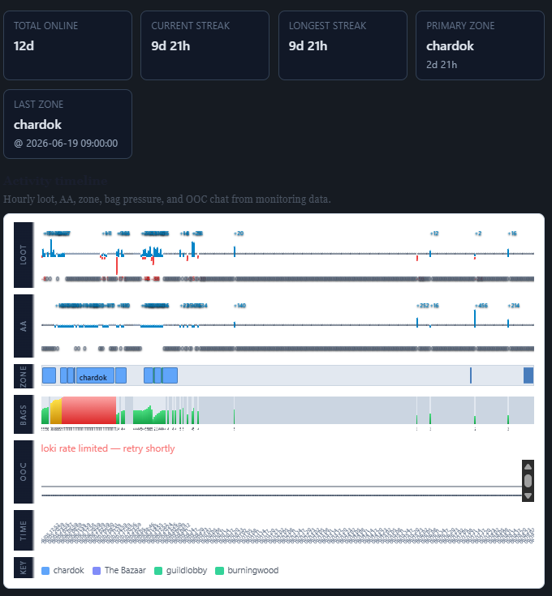

Read it left to right:

- **Loot:** blue bars = items gained per hour; red = vendor dumps or clears.
- **AA:** steady blue ticks during camp hours.
- **Zone:** dominant color = where the character sat.
- **Bags:** green → yellow → red as inventory fills; long red blocks mean "full bags, still in zone."

A **100.4%** bag fill day followed by a **49.6%** drop after a vendor trip is visible in the daily cards tied to this timeline (not cropped here; same character, Jun 7 - 8 UTC).

---

## Signal rules (hard camp, trickle AFK, multibox)

Above the timeline, BotWatch attaches **human-readable signal bullets** when rule thresholds fire. Example badge: **TRICKLE AFK HARD CAMP MULTIBOX**.

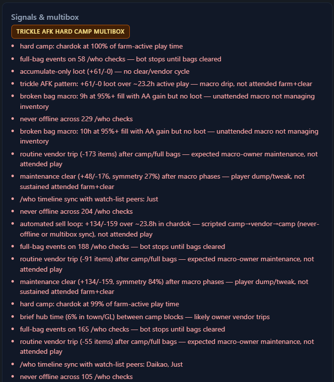

Representative signals from this exhibit (paraphrased, peers not named):

- Hard camp: one zone at **~99 - 100%** of farm-active time.
- Full-bag events on dozens of `/who` checks; loot stalls until clear.
- **+61 / −0** loot over ~23h active play (accumulate-only, no attended clear cycle).
- **Never offline** across 100+ consecutive `/who` samples.
- `/who` timeline sync with other **watch-list peers** (multibox cluster hint).
- Automated sell loop: large +/− item swing over ~24h in camp (scripted camp → vendor → camp).

These are **pattern labels**, not staff actions. They explain why the AI column lands high without claiming mind-reading.

---

## Economy and loot rollups

Inventory snapshots feed **period loot gain** tables with vendor-estimated coin:

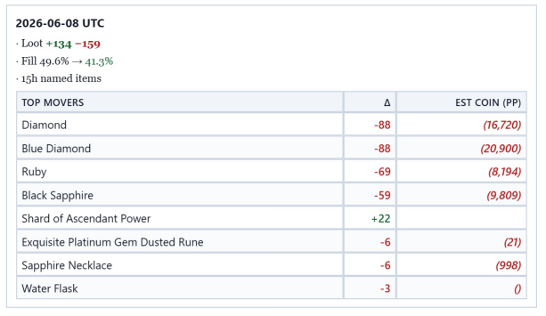

Example period totals from this watch target:

| Item | Count | Est. total (vendor) |
|------|------:|--------------------:|
| Black Sapphire | 91 | 15,129 |
| Ruby | 88 | 10,450 |
| Diamond | 48 | 9,120 |
| Blue Diamond | 33 | 7,838 |

Roster-level **Books / Economy** columns (shard, mark, tome rollups) exist for guild and unguilded populations; the character drill-down adds item-level vendor lists when named loot is present in pulls.

---

## Guild-level rollups

The **Guilds** tab aggregates the same flags and AI averages across member sets. A correct Mask-mode guild rollup crop is **not in this package yet** (an earlier file on disk was a mislabeled period-loot panel, not the Guilds tab).

> Exhibit withheld: guild rollup screenshot pending re-export with guild names masked. Prose metrics below are from a masked roster snapshot, not the bad crop.

The **(No guild)** row in one snapshot: **7,070** members, **68d** cumulative activity time, thousands of moon/bag flags, **19** actively monitored characters, **low** average AI (mixture masks outliers). Smaller guild rows can show **high** average AI when most members are camp-synchronized.

Useful for answering "is this one bad apple or a guild-wide macro farm?" without naming individuals in public exports.

---

## Data coverage and pattern index

Every character page ends with a **coverage** footer: how many snapshots, report days, and monitored hours backed the charts.

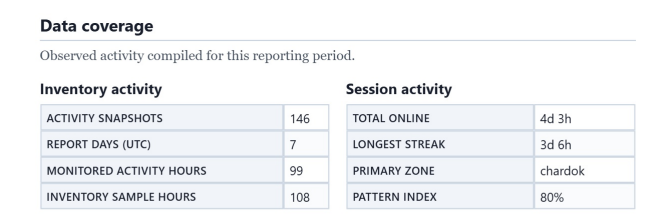

Example footer for the exhibits above:

| Field | Value |
|-------|------:|
| Activity snapshots | 146 |
| Report days (UTC) | 7 |
| Monitored activity hours | 99 |
| Inventory sample hours | 108 |
| Pattern index | 80% |

**Pattern index** is BotWatch's rolled-up automation suspicion for the period (same family as the roster **AI** column). **80%** here means "rules fired consistently across the observed window," not "staff reviewed and confirmed."

---

## RMTkr: donation ledger and market intel

BotWatch includes an **RMTkr** panel beside the roster. It is the money-and-market side of the same investigation: USD in through Ko-fi, plat value out through third-party sales forums.

### Ledger (Ko-fi reconstruction)

The **Ledger** tab pulls Ko-fi on a schedule (`ascendant-donation-feed-sync`), retains rows when the public feed hides them, and plots cumulative tips against investigator infra estimates. Section crops also appear in [05-donations-moa-kofi](05-donations-moa-kofi.md); this is the full tab layout.

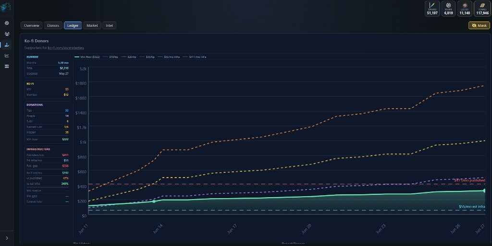

Jun 27 snapshot readout (same numbers as [data/investigator-cost.json](data/investigator-cost.json)):

| Block | Values |
|-------|--------|
| Runway | **5.38 mo**, **$2,210** total (updated May 27) |
| Ko-fi tiers | **$5** min tip, **$12** member sub |
| Donations | **50** tips, **14** people, **6** subs, **$322** min-floor cumulative |
| Infra compare | **$411/mo** published vs **$55/mo** est infra (**$356** gap); Ko-fi est **$192/mo** |

The chart overlays tip bands ($5 / $12 / $35 assumptions) on the cumulative line. Even conservative floors sit below the published **$411/mo** hosting story; see [11-hosting-cost-gap](11-hosting-cost-gap.md) for the infra math.

**Market** and **Intel** tabs are wired in the UI for ECTunnel / marketplace scrapers and curated case notes (Phase P2/P3 in BotWatch plans). Listings below were captured from public forum search until that automation ships.

### Third-party plat market (forum capture)

Ascendant plat trades on public emu RMT boards. BotWatch archives search hits to anchor **USD per thousand plat (pp)** without trusting in-game chat quotes alone.

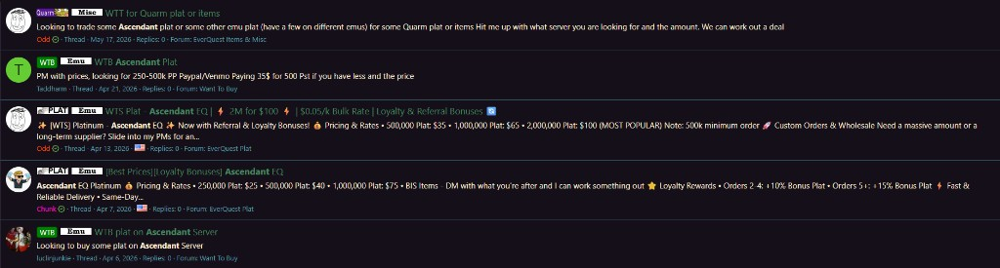

Representative **WTS** tiers from Apr 2026 listings in the capture (third-party sellers, not staff):

| Plat bundle | USD | Implied $/k |
|-------------|----:|------------:|
| 250,000 | $25 | $0.10 |
| 500,000 | $35 - 40 | $0.07 - 0.08 |
| 1,000,000 | $65 - 75 | $0.065 - 0.075 |
| 2,000,000 | $100 | **$0.05** (advertised bulk) |

Several posts bundle **loyalty and referral bonuses** (extra plat for repeat buyers). **WTB** rows in the same capture ask for **250 - 500k** via PayPal/Venmo, which confirms active two-sided demand.

**Why track this next to BotWatch roster data:**

- High-AFK farms in [06-enforcement-asymmetry](06-enforcement-asymmetry.md) generate vendor-estimated loot ([period loot table](#economy-and-loot-rollups) above). Forum **$0.05/k** bulk is the cash-out reference players use when comparing MoA bazaar prices (~4.5 - 5k plat per Mark) to real money ([05-donations-moa-kofi](05-donations-moa-kofi.md)).
- This does **not** prove staff run RMT. It proves the **secondary market exists**, is priced, and is easy to monitor from public posts while operators claim a non-commercial donation lane.

Planned automation (`ectunnel`, PlayerAuctions, similar) will feed the **Market** tab; forum captures like this are the manual baseline.

---

## Why this matters for the rest of the report

1. **Players who raised camp concerns** brought timestamps, camp video, and long-uptime evidence and were told to talk to Straps or mocked. BotWatch shows the same reconstruction is **mechanical** from public-ish telemetry (`/who`, periodic inventory headers), not a one-off vendetta.
2. **Enforcement asymmetry ([06](06-enforcement-asymmetry.md))** is easier to see when high pattern-index characters stay on roster while ban activity did not track the AFK queue. The tool does not prove staff ignored logs; it proves **the logs are buildable**.
3. **Methodology and cost** stay in [09-botwatch-methodology](09-botwatch-methodology.md). Ko-fi dashboard crops stay in [05-donations-moa-kofi](05-donations-moa-kofi.md). RMTkr Ledger and forum plat listings: [RMTkr section](#rmtkr-donation-ledger-and-market-intel) above.

BotWatch is author-run, not Ascendant staff. If operators deploy similar visibility internally, the question for players is unchanged: **what triggers action once the pattern index is high?**

Previous: [09-botwatch-methodology](09-botwatch-methodology.md) · Next: [10-witness-summary](10-witness-summary.md)
