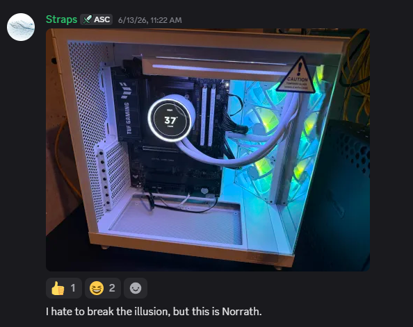
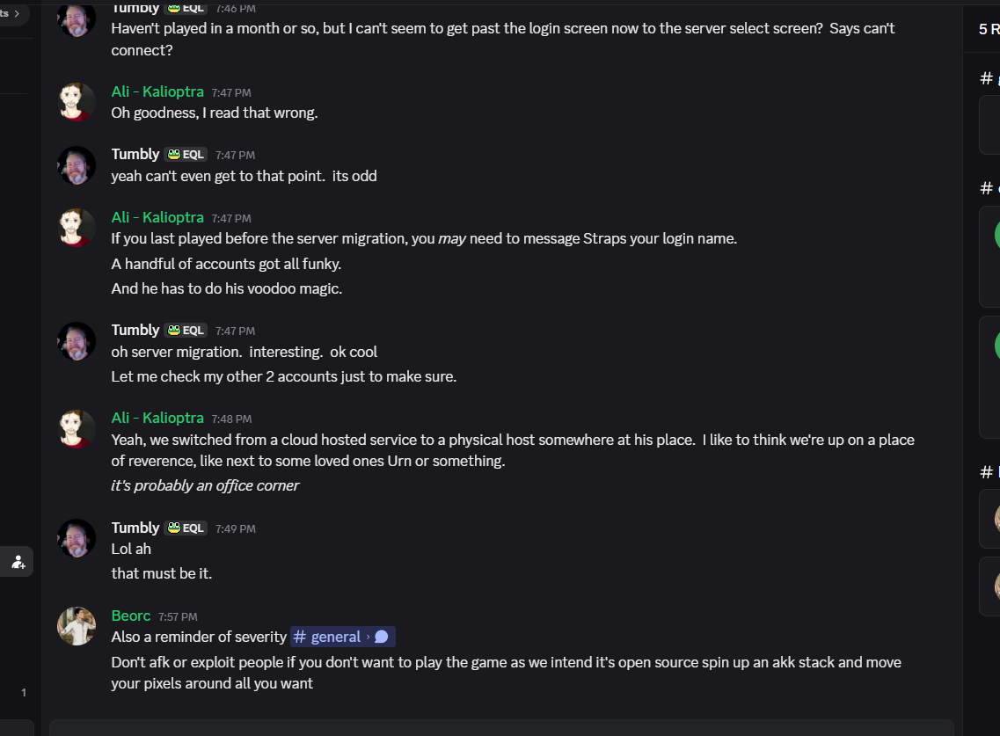
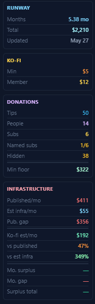
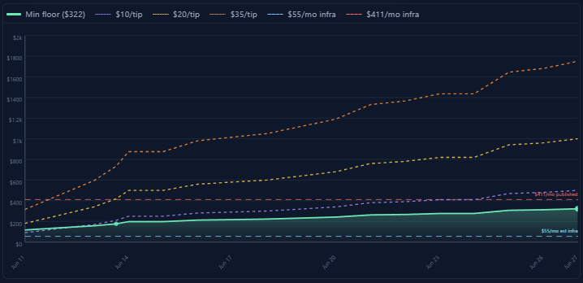

# 11 - Hosting cost gap

## The question

Ascendant's Ko-fi support page and runway widget cite ~**$411/month** as the burn rate behind multi-month runway. The copy frames donations as covering **hosting** and running costs. Where does that number go if the **live world** runs on residential AT&T and probes found no game ports on OVH?

## What the support page claims vs what probes show

**Public fundraising copy (observed):** Ko-fi and Server Support language blends "hosting," operating, maintenance, tooling, and development into one story. The **runway widget** uses a single **~$411/mo** rate (BotWatch `monthly_rate`, Jun 27 2026 snapshot). Donors reading "hosting" reasonably picture **datacenter invoices**.

**Probe-confirmed infrastructure (Jun 2026):**

| Layer | Reality | Typical bill shape |
|-------|---------|-------------------|
| Website, patch CDN, character APIs | OVH US (`147.135.10.69`) | Small VPS / cloud slice |
| Live EQEmu world | AT&T residential (`99.42.xxx.xxx`) | Home broadband + power |
| Federation login | OVH Canada (`login.eqemulator.dev`) | Separate small cloud bill (not in estimate below) |

The game process is **not** on the OVH line donors implicitly fund when they read "hosting."

## Exhibit A: Norrath at home (operator's words)

White NZXT case, ASUS TUF board, photo posted in public `#general`. **No redaction** (operator published it).

**Straps, `#general`, 2026-06-13T15:22:18Z, ID `1515375773584720067`:** "I hate to break the illusion, but this is Norrath."

**Permalink:** https://discord.com/channels/1467192820610764871/1467192820610764873/1515375773584720067

## Exhibit B: Staff admission (residential move)

Ali (Kalioptra) described Straps moving from cloud hosting to a **physical machine at his place** (capture in image). Non-staff handles redacted in image if present.

## Exhibit C: Independent probe

**Hosting validation, 2026-06-12:**

| Target | IP | Provider |
|--------|-----|----------|
| `ascendanteq.com` | 147.135.10.69 | OVH (web only) |
| `eqemu.ascendanteq.com` | 99.42.xxx.xxx | AT&T residential, Illinois Metro East |
| Game ports on residential IP | 5998, 9000 | **Open** |

OVH IP serves nginx portal; **no** game ports open on OVH.

## Reconciling $411/mo vs actual infrastructure

BotWatch runway API matched the public **~$411/mo** figure. That rate drives "months of runway" on the support page. Investigators asked a narrower question: **if $411 is infrastructure, what infrastructure?**

**Generous monthly estimate** for probe-confirmed **infrastructure only** (documented in [data/investigator-cost.json](data/investigator-cost.json)):

| Category | Generous estimate | Basis |
|----------|-------------------|--------|
| OVH web portal (site, downloads, shared Ascendant/ProFusion front door) | **$28/mo** | High end of typical small-VPS range ($10-28 observed in comparable stacks) |
| Electricity (24/7 home game PC) | **$22/mo** | Generous draw for always-on desktop/server-class box |
| Residential ISP marginal uplift | **$5/mo** | Consumer AT&T line; game traffic mostly rides existing home service |
| **Total infrastructure (generous)** | **~$55/mo** | Rounded investigator estimate, not operator books |

That is **~7.5× lower** than the **$411/mo** runway divisor presented on Ko-fi.

BotWatch Ko-fi Donors panel (Jun 27 2026): **Published/mo $411**, **Est infra/mo $55**, **Pub. gap $356**, **Ko-fi est/mo $192** (**47%** of published runway rate, **349%** of generous infra estimate). Runway widget: **5.38 mo** on **$2,210** (May 27 update). Investigator view, not operator disclosure.

Same dashboard, chart crop: tier-minimum **min floor ($322)** stays under the **$411/mo published** line; a **$10/tip** band crosses it by late June. **$55/mo est infra** sits near the bottom of the scale.

**Fair read on the other side:** If you priced operator time, development, volunteer coordination, tooling subscriptions, and a sensible reserve at anything like real labor cost, **total operation could very well be $411/mo or higher**. The number is not inherently absurd as a **whole-project** burn rate. The problem is **what they say it is**. Ko-fi and Server Support present the runway divisor under **hosting** and running-cost language, not as a labeled blend of infra + labor + tools. Donors reading "hosting" are not consenting to a salary line item they cannot see.

**Not included in the $55** (but often what donors might assume "hosting" covers):

- Operator labor and development time
- Software subscriptions, AI tooling, Ko-fi fees
- `login.eqemulator.dev` OVH Canada (federation gateway)
- Hardware replacement (the "Norrath" PC itself)
- ProFusion's separate OVH game host (different server, same operator cluster)

The gap is not "they spend exactly $55" or "$411 is impossible." It is that **$411 is marketed through a single infrastructure runway line** while the **probe-confirmed stack** looks like **~$55/mo in generous infrastructure burn**, and **labor, tools, and reserve are never broken out** even though they may explain most of the real monthly cost.

## Investigator baseline (same class of OVH web edge)

This report's author runs a separate OVH US VPS for **~$50/year** on the invoice (promotional/yearly tier; see [data/investigator-cost.json](data/investigator-cost.json)). Public surface: a static TLS site only. **Compare to Ascendant's OVH web layer** (`ascendanteq.com`, `147.135.10.69`): nginx portal, patch/downloads front door, character APIs, shared ProFusion/Ascendant web cluster ([04-infrastructure-security](04-infrastructure-security.md)). Same *category* (public web + TLS + operator APIs), not the same scope (no patch CDN at Ascendant scale, no shared multi-server portal).

**Apples to apples:** bedroom **game world** vs VPS **web edge** are different layers. Ascendant's game runs on AT&T residential; this baseline does not host an EQEmu world on OVH either. The point is narrower: **a single small OVH VPS can carry a modern TLS web presence and a minimal public API** for **~$4/mo amortized**, while Ko-fi presents **~$411/mo** as infrastructure burn and generous third-party estimates put Ascendant's **web+home infra slice** around **~$55/mo** ([table above](#reconciling-411mo-vs-actual-infrastructure)). The author's stack is not Ascendant's stack; it is a **reference price anchor** for what OVH web hosting actually costs when you are not bundling labor into the "hosting" line.

Home-lab power, debian MySQL, and Windows admin API are **not** included in the $50/year VPS line.

Ledger shows large single-day Ko-fi inflows (creator dashboard) not visible on thinned public feed. That is a separate transparency issue (chapter [05-donations-moa-kofi](05-donations-moa-kofi.md)). This chapter is only the **hosting math**.

Publishing runway months without splitting **cloud vs home vs labor vs reserve** misleads donors who think they pay **$411/mo of datacenter hosting** when the world runs in a bedroom on AT&T.

Next: [12-operator-presence](12-operator-presence.md)
