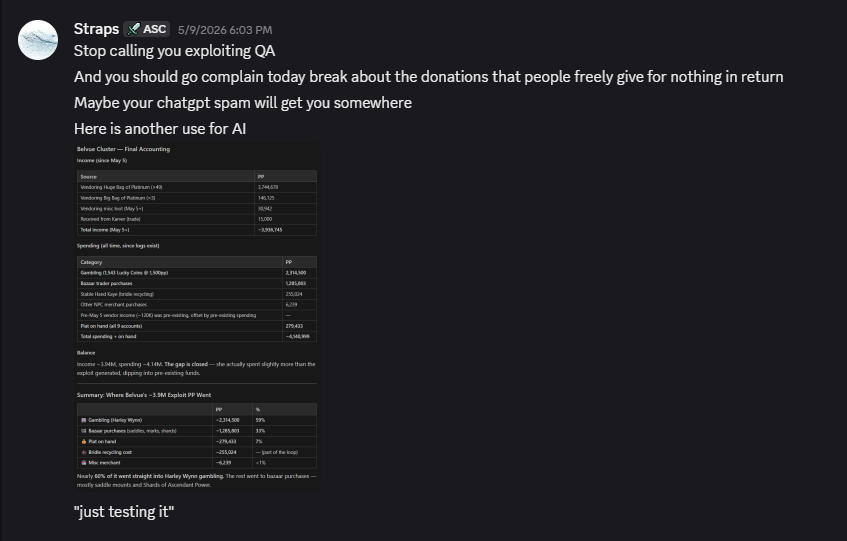
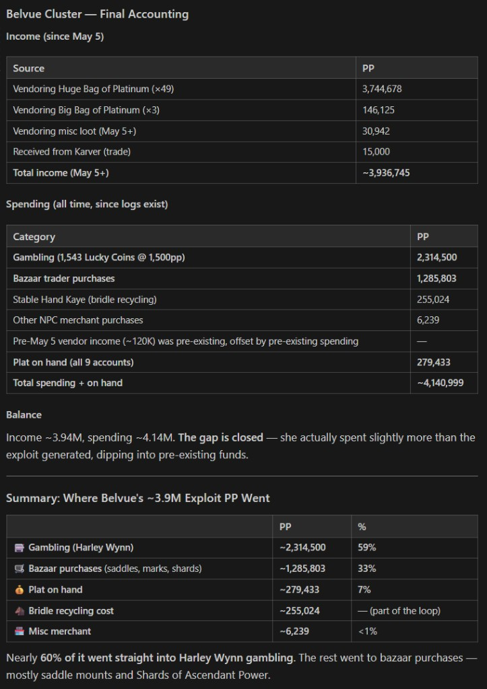

# 14 - Reporter account

First-person timeline. Short close: [15-closing-statements](15-closing-statements.md).

## May 8 disclosure

On **May 8, 2026** I **found and disclosed** a bridle/stable-hand plat exploit the same day. After selling Ssra bridles I noticed the same bridles could be bought back from a vendor at a much lower price than the platinum bags sold for through the quest line. I bought every color and variation to see which paths worked and which did not, so I could write a full post-mortem before staff saw it. Four colors, four variations, and variance testing put me at roughly **25×** with about **2M plat in ~10 minutes**. I timed growth manually: **~1M plat in ~3 minutes** by hand; anything faster would have looked like automation.

I used that plat for two things: checking currency leaderboards for anyone else who might have hit the same path, and chasing a bazaar bug where stacked items no longer on a trader could still move plat from buyer to seller without delivering the item[^1]. When I was at **~3.89M** on character I parceled plat to myself, small chunks first and then larger ones. Parcel-held plat does not count toward leaderboard totals, which let me keep my name off the leaderboards while still keeping a clean auditable trail for Straps and team to review.

Before that day I had already found other bugs and exploits I had not reported. I distrusted how staff would handle disclosure, and most of what I had seen gave individual players an edge rather than threatening the whole server. I also did not want to replicate real-life work inside a game I was playing to unwind. The bridle loop was different. It moved plat through the entire economy. I could not sit on it.

I opened a private Discord thread with **Kali** that same day, disclosed what I had found, and raised the economy impact. His reply was that he forgot about platinum bags. Within roughly **20 minutes** all my accounts were banned.

I logged a trader alt and told Straps plainly: *So that's how it is.* His reply was callous, snide, and rude. I do not handle authority like that well, but I still gave them the benefit of the doubt and sent the full post-mortem ([14b-preliminary-rca](14b-preliminary-rca.md)). No response. No acknowledgment. Radio silence.

When the post-mortem got radio silence, the next day I started filing a backlog in the public bugs channel: issues I had already documented, written plainly. Staff dismissed much of it as "AI slop." When I came back later, many of those same items had been fixed. I will be direct about my headspace then: I was angry, and part of me wanted to see whether serious concerns would get a factual answer or only narrative spin. That is not the same as a calm disclosure path, and I would not handle it the same way today. The bugs were real; the tone and volume after the ban were not.

That frustration finally drew a response, about three minutes after one of those bug-channel pushes. **Straps** posted in Discord on **2026-05-09** with mockery ("Stop calling you exploiting QA," "Maybe your chatgpt spam will get you somewhere") and an AI-generated **"Belvue Cluster - Final Accounting"** ledger.

The ledger labels income **"since May 5"** and assigns **59%** of exploit plat to **Harley Wynn gambling at 1,500pp per Lucky Coin** (1,543 coins). I lack confirmation I can travel through time; I suspect I cannot. The embed still books **May 8** bridle plat against **May 5** token purchases. I dispute the path itself too: **AA transmutes**, not 1,500pp Harley purchases. Lucky Coin activity on the cluster predates the bridle window; check the timestamps. If we really held that much plat and burned it on coins, we would have bought every cheap listing on bazaar and `#auction` first (530 - 700pp was common); we did not sweep the market. See [lucky-coin-market-reference](data/lucky-coin-market-reference.md#market-sweep-vs-npc-premium-common-sense-check) and [14c - open request to staff](14c-may-5-ledger-audit.md#open-request-to-ascendant-staff).

I came back because I missed the social side of the game and kept watching how staff handled reports. I saw players report speed hacking, AFK bots, and other questionable behavior. Staff met a lot of it with sarcasm and dismissal. I dug into public records, Discord, and telemetry instead of trusting private tickets.

**Beorc** keeps taking stabs at me in `#general`, mostly when I comment as **Belvue** (this report) or from an alt I am not naming here. Permabanned and he still runs the ban-comedy bit for the room. Not policy, not enforcement, just petty needling from staff. On-record examples: [discord-quotes-public](data/discord-quotes-public.md) (`14-reporter-account`).

A third party shared a screenshot of a speed report where someone said **"They told me 1.4 was ok"** (who "they" were is unknown). **1.4** is 0.1 below the **1.5×** anti-cheat threshold in Ascendant's EQEmu fork ([14d-anti-cheat-layers](14d-anti-cheat-layers.md)).

None of this behavior sat well with me, and couldn't understand why people would take on an effort of running a game server and hold such disdain for the community. And that's where the Ko-Fi pruning started to make sense.

My biggest regret is leaning on ChatGPT drafts in public channels without tightening them myself after guardrails changed. That gave staff an easy dismissive label even when the underlying bugs were valid.

---

[^1]: This is part of an exploit fix attempt by Straps where if you forcibly crash a trader and make a purchase of a stacked item less than the full stack amount the item would remain on the trader, and send to the buy creating an item duplication. Post his fix implementation the plat is transfered to the trader, and the item is then deleted from trader and never sent to the purchaser. This absolutely stops item duplication but creates a different catastrophic issue.

Previous: [13-what-you-can-do](13-what-you-can-do.md) · Next: [15-closing-statements](15-closing-statements.md) · Appendices: [14b-preliminary-rca](14b-preliminary-rca.md), [14c-may-5-ledger-audit](14c-may-5-ledger-audit.md), [14d-anti-cheat-layers](14d-anti-cheat-layers.md)
